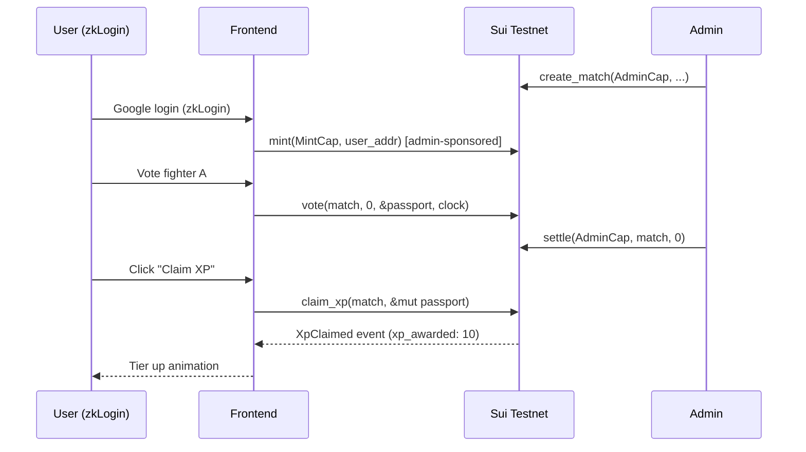

# KIZUNA Fan Passport — Architecture Specification

- **Version**: 0.1 (MVP / Hackathon)
- **Date**: 2026-04-25
- **Target Network**: Sui Testnet
- **SUI Protocol**: v1.69.1 (Protocol 119)
- **Move Edition**: 2024

---

## 1. Executive Summary

KIZUNA is a soulbound, dynamic Fan Passport for ONE Championship Japan fans, paired with a zero-money Pick'em prediction module. Fans log in with Google (via Sui zkLogin), claim a non-transferable Passport NFT, vote on upcoming fights, and earn on-chain **Honor XP** that auto-upgrades their Tier.

**Hackathon scope**: three flows end-to-end — (1) zkLogin + Passport mint, (2) Pick'em vote + settle, (3) XP claim + Tier progression. All other Strategy-Report proposals (Compliance Studio, Arena Experiences, Fighter Hub) are out of scope.

**Why Sui, not EVM**: soulbound enforced at the type system (no `store` ability); dynamic progression via native object mutation (no metadata migration); owned-object model forces a pull-based XP claim that doubles as a security feature (no admin can mutate another user's Passport).

---

## 2. Architecture Overview

```
┌─ Frontend (Next.js + @mysten/dapp-kit) ──────────────┐
│  zkLogin (Google → Mysten Salt Service)              │
│  Passport Viewer | Pick'em UI | XP Claim button      │
└───────────────────────┬──────────────────────────────┘
                        │ PTB (Transaction)
                        │ GraphQL (read)
┌───────────────────────▼──────────────────────────────┐
│ Sui Testnet (Protocol 119)                           │
│                                                      │
│  kizuna::passport (module)                           │
│   ├─ Passport {key}        ← soulbound, owned        │
│   └─ MintCap {key, store}  ← admin holds             │
│                                                      │
│  kizuna::pickem (module)                             │
│   ├─ Match {key}           ← shared, one per fight   │
│   ├─ AdminCap {key, store} ← create/settle matches   │
│   └─ MatchSettled {event}  ← indexer signal          │
│                                                      │
│  Uses: sui::clock::Clock (shared)                    │
└───────────────────────┬──────────────────────────────┘
                        │ listen
┌───────────────────────▼──────────────────────────────┐
│  Oracle Script (Node.js, manual trigger for demo)    │
│  Calls settle(AdminCap, match, winner)               │
└──────────────────────────────────────────────────────┘
```

---

## 3. Module Design

### 3.1 `kizuna::passport`

**Purpose**: issue and evolve soulbound Fan identities.

```move
module kizuna::passport;

use std::string::String;

const E_TIER_UNDERFLOW: u64 = 1;

/// Soulbound: only `key`, NO `store` → cannot be wrapped, transferred, or put in Kiosk.
public struct Passport has key {
    id: UID,
    display_name: String,
    honor_xp: u64,
    correct_predictions: u64,
    total_predictions: u64,
    current_streak: u64,
    best_streak: u64,
    tier: u8,            // 0 Rookie, 1 Samurai, 2 Ronin, 3 Shogun, 4 Legend
    minted_at_ms: u64,
}

public struct MintCap has key, store { id: UID }

/// One-time init: publisher gets MintCap, AdminCap (pickem) is created in pickem::init.
fun init(ctx: &mut TxContext) {
    transfer::public_transfer(
        MintCap { id: object::new(ctx) },
        ctx.sender()
    );
}

/// Admin-gated mint (can be opened to public in v2 with a Registry check).
public entry fun mint(
    _: &MintCap,
    display_name: String,
    recipient: address,
    clock: &Clock,
    ctx: &mut TxContext,
) { /* transfer::transfer to recipient */ }

/// Called by pickem::claim_xp via public(package) — only same package can mutate XP.
public(package) fun add_xp(p: &mut Passport, base: u64, streak_bonus: u64, correct: bool) {
    p.honor_xp = p.honor_xp + base + streak_bonus;
    p.total_predictions = p.total_predictions + 1;
    if (correct) {
        p.correct_predictions = p.correct_predictions + 1;
        p.current_streak = p.current_streak + 1;
        if (p.current_streak > p.best_streak) p.best_streak = p.current_streak;
    } else {
        p.current_streak = 0;
    };
    p.tier = compute_tier(p.honor_xp);
}

fun compute_tier(xp: u64): u8 {
    if (xp >= 1500) 4
    else if (xp >= 600) 3
    else if (xp >= 200) 2
    else if (xp >= 50) 1
    else 0
}
```

**Key design choices**:
- `key` only, no `store` → Move's type system guarantees soulbound. Attempting `transfer::public_transfer` would not compile.
- `public(package)` `add_xp` → only `kizuna::pickem` can mutate XP. External modules cannot forge XP without publishing a new version of the package.
- Tier computed on every XP change → on-chain truth, frontend never lies about status.

### 3.2 `kizuna::pickem`

**Purpose**: manage fight predictions with Clock-based lock and pull-based XP claim.

```move
module kizuna::pickem;

use sui::clock::Clock;
use sui::event;
use sui::table::{Self, Table};
use std::string::String;
use kizuna::passport::{Self, Passport};

const E_VOTING_LOCKED: u64 = 100;
const E_ALREADY_VOTED: u64 = 101;
const E_NOT_SETTLED: u64 = 102;
const E_ALREADY_CLAIMED: u64 = 103;
const E_DID_NOT_VOTE: u64 = 104;
const E_INVALID_CHOICE: u64 = 105;

public struct AdminCap has key, store { id: UID }

public struct Match has key {
    id: UID,
    fighter_a: String,
    fighter_b: String,
    locked_at_ms: u64,
    winner: Option<u8>,                  // 0 = A, 1 = B, None = unsettled
    votes: Table<address, u8>,           // voter addr → choice
    claimed: Table<address, bool>,       // prevents double claim
    base_xp: u64,                        // e.g. 10
}

public struct MatchCreated has copy, drop { match_id: ID, fighter_a: String, fighter_b: String, locked_at_ms: u64 }
public struct VoteCast     has copy, drop { match_id: ID, voter: address, choice: u8 }
public struct MatchSettled has copy, drop { match_id: ID, winner: u8 }
public struct XpClaimed    has copy, drop { match_id: ID, voter: address, correct: bool, xp_awarded: u64 }

fun init(ctx: &mut TxContext) {
    transfer::public_transfer(AdminCap { id: object::new(ctx) }, ctx.sender());
}

public entry fun create_match(
    _: &AdminCap,
    fighter_a: String,
    fighter_b: String,
    locked_at_ms: u64,
    base_xp: u64,
    ctx: &mut TxContext,
) {
    let m = Match { /* ... */ };
    let mid = object::id(&m);
    event::emit(MatchCreated { match_id: mid, fighter_a, fighter_b, locked_at_ms });
    transfer::share_object(m);
}

public entry fun vote(
    m: &mut Match,
    choice: u8,
    _passport: &Passport,     // proof of soulbound holder; not mutated here
    clock: &Clock,
    ctx: &mut TxContext,
) {
    assert!(choice == 0 || choice == 1, E_INVALID_CHOICE);
    assert!(clock.timestamp_ms() < m.locked_at_ms, E_VOTING_LOCKED);
    let voter = ctx.sender();
    assert!(!m.votes.contains(voter), E_ALREADY_VOTED);
    m.votes.add(voter, choice);
    event::emit(VoteCast { match_id: object::id(m), voter, choice });
}

public entry fun settle(_: &AdminCap, m: &mut Match, winner: u8) {
    assert!(winner == 0 || winner == 1, E_INVALID_CHOICE);
    m.winner = option::some(winner);
    event::emit(MatchSettled { match_id: object::id(m), winner });
}

public entry fun claim_xp(m: &mut Match, passport: &mut Passport, ctx: &mut TxContext) {
    assert!(m.winner.is_some(), E_NOT_SETTLED);
    let voter = ctx.sender();
    assert!(m.votes.contains(voter), E_DID_NOT_VOTE);
    assert!(!m.claimed.contains(voter), E_ALREADY_CLAIMED);

    let choice = *m.votes.borrow(voter);
    let winner = *m.winner.borrow();
    let correct = choice == winner;

    // Streak bonus derived from CURRENT streak BEFORE update
    let streak_bonus = compute_streak_bonus(passport::current_streak(passport), correct);
    let awarded = if (correct) { m.base_xp + streak_bonus } else { 0 };

    passport::add_xp(passport, if (correct) m.base_xp else 0, streak_bonus, correct);
    m.claimed.add(voter, true);

    event::emit(XpClaimed { match_id: object::id(m), voter, correct, xp_awarded: awarded });
}

fun compute_streak_bonus(current_streak: u64, correct: bool): u64 {
    if (!correct) 0
    else if (current_streak >= 4) 50   // this claim will make it 5
    else if (current_streak >= 2) 20   // this claim will make it 3
    else 0
}
```

**Key design choices**:
- `vote` takes `&Passport` (read-only) → passport is not locked during voting; user can vote on multiple matches in parallel.
- `claim_xp` takes `&mut Passport` → only the Passport owner can sign this tx (owned object), so admin cannot forge XP.
- `claimed: Table<address, bool>` → prevents replay. Could be optimised to a Bag or bitmap in v2.
- Streak bonus computed from **current** streak; order of claims matters and is user's choice (feature, not bug — lets power users plan claim order for max bonus).

---

## 4. Permission System (Capabilities)

| Capability   | Holder            | Powers                                  | Risk if Lost                 |
| ------------ | ----------------- | --------------------------------------- | ---------------------------- |
| `MintCap`    | Deployer (admin)  | Mint Passports                          | Attacker can spam Passports (but they're soulbound, low harm) |
| `AdminCap`   | Deployer (admin)  | Create matches, settle results          | Attacker can create fake matches and settle fraudulently → XP inflation |
| `UpgradeCap` | Deployer (admin)  | Upgrade package                         | Attacker can replace logic entirely |

**MVP posture**: all three held by one deployer key. Spec explicitly flags that production must migrate to multisig (e.g., 2-of-3 with legal/ops co-signers).

---

## 5. Event System

Events are the primary integration surface for the frontend indexer and future analytics.

| Event           | Emitted by        | Purpose                                           |
| --------------- | ----------------- | ------------------------------------------------- |
| `MatchCreated`  | `create_match`    | Frontend lists upcoming matches                   |
| `VoteCast`      | `vote`            | Real-time vote counter on match page              |
| `MatchSettled`  | `settle`          | Trigger "Claim XP" button on affected passports   |
| `XpClaimed`     | `claim_xp`        | Leaderboard updates, highlight big streak bonuses |

Frontend uses **GraphQL beta** (`@mysten/sui` GraphQL client) for event subscription. gRPC is the production target; JSON-RPC deprecated April 2026.

---

## 6. Security Considerations

### 6.1 Threat Model (MVP scope)

| Threat                               | Severity | Mitigation                                                                     |
| ------------------------------------ | -------- | ------------------------------------------------------------------------------ |
| Passport transferred / sold          | Critical | `key` only, no `store` → enforced by Move compiler                             |
| Admin forges XP on user's Passport   | Critical | Passport is owned object → only owner's signature can mutate it                |
| Double-claim XP for same match       | High     | `claimed: Table<address, bool>` check in `claim_xp`                            |
| Voting after lock time               | High     | `clock.timestamp_ms() < locked_at_ms` assertion using shared `Clock`           |
| Voting without a Passport (sybil)    | High     | `vote` requires `&Passport`; zkLogin ties 1 Google account ≈ 1 address         |
| Admin key compromise                 | High     | Flagged for production (multisig). MVP accepts the risk on testnet.            |
| XP inflation via fake matches        | Med      | Requires AdminCap — same as above                                              |
| Integer overflow on XP               | Low      | `u64` caps at ~1.8e19; realistic XP volumes nowhere near                       |
| Replay of `vote` tx                  | Low      | Sui tx digests are unique; `ALREADY_VOTED` check belt-and-braces               |

### 6.2 Out-of-scope (documented, not fixed in MVP)

- zkLogin salt migration if user changes Google account → Passport becomes orphan
- Match result disputes (no on-chain oracle; admin is the oracle)
- Rate limiting on `mint` (admin-gated so low risk)

### 6.3 Red Team targets (for `sui-red-team` skill)

1. Can an attacker construct a `Passport` outside of `mint`? (Answer: no — `Passport` has no public constructor)
2. Can `add_xp` be called from another package? (Answer: no — `public(package)`)
3. Can the same user vote twice by re-wrapping the tx? (Answer: no — Table check)
4. Can `claim_xp` be called with a Passport that did not vote? (Answer: no — `DID_NOT_VOTE`)
5. Can `settle` be called twice with different winners? (Answer: currently yes — **TODO: add `assert!(m.winner.is_none())`**)

---

## 7. Tool Integration Plan

| Need                    | Tool                            | MVP? | Notes                                              |
| ----------------------- | ------------------------------- | ---- | -------------------------------------------------- |
| Auth                    | **zkLogin** (Mysten Salt svc)   | ✅   | Google OAuth only                                  |
| Frontend SDK            | `@mysten/dapp-kit-react`        | ✅   | v1.69.1-compatible                                 |
| PTB construction        | `@mysten/sui` (Transaction API) | ✅   | NOT `@mysten/sui.js` (legacy name)                 |
| Data access             | GraphQL beta                    | ✅   | Event subscription + Passport queries              |
| Storage (Passport image)| IPFS pin or hardcoded URL       | ✅   | Walrus deferred to v2                              |
| Passkey                 | —                               | ❌   | v2                                                 |
| Walrus                  | —                               | ❌   | v2 (dynamic image per tier)                        |
| Kiosk                   | —                               | ❌   | Passport is soulbound, Kiosk N/A                   |

---

## 8. Data Layer

- **Current state reads** (Passport owned by user, Match shared): GraphQL `object` query.
- **Historical analytics** (leaderboard, vote totals): subscribe to events via GraphQL, aggregate in a thin Next.js API route. No custom indexer needed for MVP.
- **If judges ask about scale**: answer with the `sui-indexer` story — event-driven indexer for leaderboards at >10k users.

---

## 9. Testing Strategy

| Layer          | Tool                       | Coverage Goal                                  |
| -------------- | -------------------------- | ---------------------------------------------- |
| Move unit      | `sui move test`            | All `assert!` branches hit, tier boundaries    |
| Move scenario  | `test_scenario`            | mint → vote → settle → claim full lifecycle    |
| Red team       | `sui-red-team` skill       | 5 attack vectors in §6.3                       |
| Integration    | TS SDK + devnet            | PTB for full flow                              |
| Monkey test    | Manual                     | Vote after lock, double claim, no-passport vote|

---

## 10. Deployment Plan

**3-day hackathon schedule**:

| Day | Morning                                   | Afternoon                                  | Night                   |
| --- | ----------------------------------------- | ------------------------------------------ | ----------------------- |
| 1   | Finalise spec (this doc) + `sui move new` | Write passport + pickem modules            | Deploy testnet          |
| 2   | Frontend scaffold + zkLogin               | Pick'em UI + Passport viewer + TS types    | End-to-end run          |
| 3   | Monkey + red team                         | Polish UI, gas report, demo deck           | Record demo, submit     |

**Deploy target**: Sui Testnet only. Devnet used for first smoke test.

---

## 11. Gas Optimization (MVP posture)

- `Table<address, u8>` is fine up to ~10k votes per match for demo. At 100k+, switch to event-only tally (no on-chain per-voter storage) and derive vote state from indexer.
- Avoid strings in hot paths (`VoteCast` does not include fighter names — frontend joins from `MatchCreated`).
- Tier is computed in-place, no separate storage write.

---

## 12. Open Questions (flagged for production)

1. Multisig AdminCap rotation — who are the 3 keyholders?
2. zkLogin salt migration / social recovery
3. Dispute resolution when admin settles wrong winner
4. Walrus-hosted dynamic Passport artwork per Tier
5. Cross-module XP sources (gym check-in, watch-party, merch scan)

---

## Appendix A — Module Dependency

```mermaid
graph TD
    pickem[kizuna::pickem] -->|public(package) add_xp| passport[kizuna::passport]
    pickem --> clock[sui::clock]
    pickem --> table[sui::table]
    pickem --> event[sui::event]
    passport --> obj[sui::object]
```

## Appendix B — Core Flow


